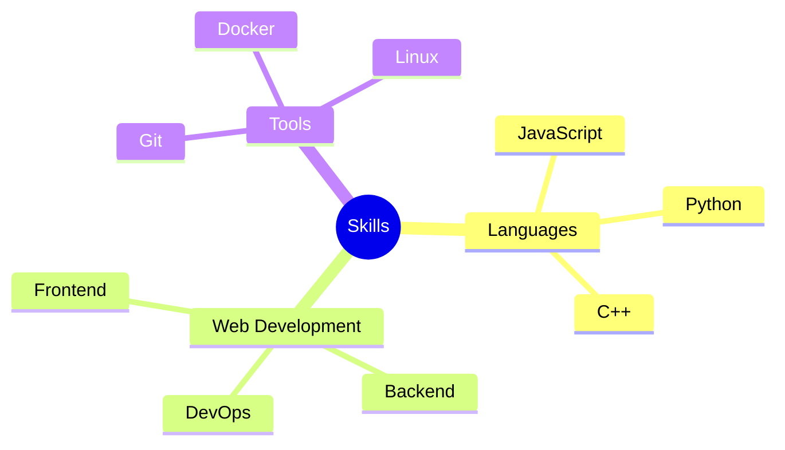

# Hi there 👋

<div align="center">


</div>

## 📊 My GitHub Journey

<div align="center">

| Stats & Metrics | Languages & Tools |
|----------------|-------------------|
|  |  |

</div>

## 🚀 Quick Facts

- 👨‍💻 I'm Brian Samuel
- 🎓 Data Science student at SLIIT 
- 💡 Interested in Web Development, System Design 
- 🔧 Working on open-source projects

## 🎯 Skills & Expertise

<div align="center">



</div>

## 🏆 Achievement Cards

<div align="center">
<table>
<tr>
<td align="center">

<br>
<b>MultiLanguage</b>
<br>
Level 5
</td>
<td align="center">

<br>
<b>Stars Earned</b>
<br>
250+
</td>
<td align="center">

<br>
<b>Commits</b>
<br>
1000+
</td>
<td align="center">

<br>
<b>Pull Requests</b>
<br>
50+
</td>
</tr>
</table>
</div>

## 📫 Connect With Me

- 📧 Email: IT23165816@my.sllit.lk
- 🌐 Website: [yourwebsite.com](https://yourwebsite.com)
- 💼 LinkedIn: https://www.linkedin.com/in/brian-samuel-952606228/

## 📈 Contribution Graph

```text
Contributions in the last year

Jan  ▮▮▮▮▮▮░░░░
Feb  ▮▮▮▮▮▮▮░░░
Mar  ▮▮▮▮▮▮▮▮░░
Apr  ▮▮▮▮▮▮▮▮▮░
May  ▮▮▮▮▮▮▮▮▮▮
```

<div align="center">

*"Code is like humor. When you have to explain it, it's bad."* – Cory House

</div>
